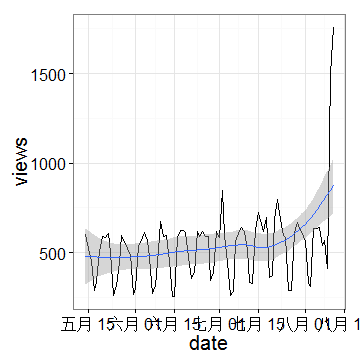
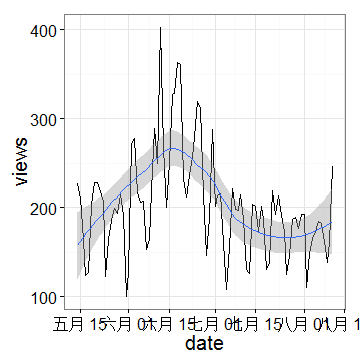

## 第一部分：数据信息

生活中，我们面临着各种各样的数据：比如你的成绩单，比如公司的财务报表，比如朋友圈的一些状态，比如微信里的一段语音……我们生活的大数据时代的一个重要特征便是数据的多样化（variety）。  
也许你期待的数据是这样的：

```
##   Sepal.Length Sepal.Width Petal.Length Petal.Width Species
## 1          5.1         3.5          1.4         0.2  setosa
## 2          4.9         3.0          1.4         0.2  setosa
## 3          4.7         3.2          1.3         0.2  setosa
## 4          4.6         3.1          1.5         0.2  setosa
## 5          5.0         3.6          1.4         0.2  setosa
```
然而事实上我们面临的数据确实这样的：
```
@HWI-EAS121:4:100:1783:550#0/1
CGTTACGAGATCGGAAGAGCGGTTCAGCAGGAATGCCGAGACGGATCTCGTATGCGGTCTGCTGCGTGACAAGACAGGGG
+HWI-EAS121:4:100:1783:550#0/1
aaaaa`b_aa`aa`YaX]aZ`aZM^Z]YRa]YSG[[ZREQLHESDHNDDHNMEEDDMPENITKFLFEEDDDHEJQMEDDD
@HWI-EAS121:4:100:1783:1611#0/1
GGGTGGGCATTTCCACTCGCAGTATGGGTTGCCGCACGACAGGCAGCGGTCAGCCTGCGCTTTGGCCTGGCCTTCGGAAA
+HWI-EAS121:4:100:1783:1611#0/1
a``^\__`_```^a``a`^a_^__]a_]\]`a______`_^^`]X]_]XTV_\]]NX_XVX]]_TTTTG[VTHPN]VFDZ
@HWI-EAS121:4:100:1783:322#0/1
CGTTTATGTTTTTGAATATGTCTTATCTTAACGGTTATATTTTAGATGTTGGTCTTATTCTAACGGTCATATATTTTCTA

```
还有这样的：
```
{
    "uid": 10438,
    "result": [
        {
            "day": "2011-12-12",
            "followers_count": "63",   //粉丝数
            "v_followers_count": "18", //V粉丝数
            "daren_followers_count": "18", //达人粉丝数
            "friends_count": "58",    //关注数
            "v_friends_count": "58",  //V关注数
            "statuses_count": "258",   //微博数
            "bi_followers_count": "18",  //互粉数
            "repost_count": "115", //转发数
            "comments_count": "178",   //评论数
        },
        ...
    ]
}

```
那么我们如何去处理这些数据，我们如何分析这些数据，从数据中找到我们想要的东西呢？我们将从如何将这些数据导入R中开始，慢慢学习如何处理，分析我们身边的大数据。  
# 第一章 数据的导入
面对各种各样纷杂的数据，我们分析的第一步便是获取数据并将其导入R中。

### 从网上获取数据

大数据的一个重要数据源便是互联网。从网络上获取数据并用来分析是非常重要的。为了得到这些数据，一个普通青年的做法便是来到一个网站，找到数据连接，然后右键->目标另存为，最后从本地文件夹中导入R。但是如果要下载的数据文件数目比较多，再这么做就从一个普通青年降级为了二逼青年。  
为了应对需要下载多个文件的情况，R提供了函数download.file()，使得R可以从互联网上直接把数据拽下来。其调用格式为：
```
download.file(url, destfile, method, quiet = FALSE, mode = "w",
              cacheOK = TRUE,
              extra = getOption("download.file.extra"))

```
主要的参数为：  
+ url:文件的所在地址
+ destfile:下载后文件的保存地址，默认为工作目录
+ method:  提供"internal", "wget", "curl" 和 "lynx"四种method，在windows上通常internal就能解决大多数的问题，少数搞不定的如Cygwin, gnuwin32这种的"wget"就可以搞定；windows的二进制文件用“curl”，这个method对于Mac的用户来说是都要设置的；“lynx”主要针对historical interest。  

##### 用法举例：获取上市公司资产负债表
比如说我们要获取一系列的上市公司财务数据，我们就要得到他们的资产负债表。当然，如果花钱买wind数据库，一切也就不用操心了。但是如果不在学校，用不了数据库的话，一个可以替代的办法就是从新浪财经里面拽数据：以安信信托(600816) 资产负债表为例，你可以访问[新浪财经](http://vip.stock.finance.sina.com.cn/corp/go.php/vFD_BalanceSheet/stockid/600816/ctrl/part/displaytype/4.phtml)就能看个明白，还可以下载。我们如果还要其他的股票，我们都可以如法炮制。那么我们通过R用download.file写一个函数来实现输入股票代码，将资产负债表下载到指定目录：

```r
getbalancesheets=function(symbol,file){
pre="http://money.finance.sina.com.cn/corp/go.php/vDOWN_BalanceSheet/displaytype/4/stockid/";
end="/ctrl/all.phtml";

url=paste(pre,symbol,end,sep="");
destfile=paste(file,"BalanceSheet_",symbol,".xls",sep="");

download.file(url, destfile);
}
```
值得注意的是：  
+ 凡是以http开头的，放心大胆的使用download.file()
+ 凡是以https开头的，这个函数可能失效
+ 在设置路径时可以通过file.exists来查看文件夹是否存在，如果不存在可以使用dir.create来创建它，避免找不到路径的烦恼。
+ 使用getwd获取当前工作路径，setwd可以改变它

### 读入本地数据
文件下载下来后，我们便需要读入这些数据。而读入这些数据的三大基本函数便是scan,read.table,read.csv。特别的基础，能读的格式基本限于txt,csv,但是其中的一些参数设置却是绝大多数读入其他格式文件里也用得到的。  
我们先来看看这三个函数的基本调用格式：
```
scan(file = "", what = double(), nmax = -1, n = -1, sep = "",
     quote = if(identical(sep, "\n")) "" else "'\"", dec = ".",
     skip = 0, nlines = 0, na.strings = "NA",
     flush = FALSE, fill = FALSE, strip.white = FALSE,
     quiet = FALSE, blank.lines.skip = TRUE, multi.line = TRUE,
     comment.char = "", allowEscapes = FALSE,
     fileEncoding = "", encoding = "unknown", text)
read.table(file, header = FALSE, sep = "", quote = "\"'",
           dec = ".", row.names, col.names,
           as.is = !stringsAsFactors,
           na.strings = "NA", colClasses = NA, nrows = -1,
           skip = 0, check.names = TRUE, fill = !blank.lines.skip,
           strip.white = FALSE, blank.lines.skip = TRUE,
           comment.char = "#",
           allowEscapes = FALSE, flush = FALSE,
           stringsAsFactors = default.stringsAsFactors(),
           fileEncoding = "", encoding = "unknown", text)

read.csv(file, header = TRUE, sep = ",", quote = "\"",
         dec = ".", fill = TRUE, comment.char = "", ...)

read.csv2(file, header = TRUE, sep = ";", quote = "\"",
          dec = ",", fill = TRUE, comment.char = "", ...)

```
其中主要参数我们简介如下：   
+ file:文件的路径
+ header:是否将第一行读作变量名
+ sep:以什么为分隔符，如“，”，“ ”等
+ row.names:你可以给每一行指定名字，col.names是给每一列指定名字
+ nrows:读取前n行，默认为读完整个文件
+ skip:从第n行开始读入
+ na.strings：缺失值的符号，比如“NA”，“？”，“ ”等。


### 读入Excel文件
Excel数据目前仍是使用十分广泛的小数据存储格式，像之前我们的财务报表就是一例。那么如何读入Excel数据呢？  
对于Excel数据一个常用的办法就是将其转存为csv格式，这就划归到我们前一个问题。  
另一个办法是将excel的数据放在剪贴板中，通过read.delim（clipbroad）来读取。
还有R中的gdata包的read.xls函数也可以解决这样一个问题。  
随着Excel的升级，Excel的格式升级为了.xlsx。R也推出了xlsx包.其用法如下：
```
read.xlsx(file, sheetIndex, sheetName=NULL, rowIndex=NULL,
  startRow=NULL, endRow=NULL, colIndex=NULL,
  as.data.frame=TRUE, header=TRUE, colClasses=NA,
  keepFormulas=FALSE, encoding="unknown", ...)

read.xlsx2(file, sheetIndex, sheetName=NULL, startRow=1,
  colIndex=NULL, endRow=NULL, as.data.frame=TRUE, header=TRUE,
  colClasses="character", ...)

```
主要参数为：  
+ file:文件路径
+ sheetIndex:Excel内部的表单数目
+ rowIndex:读取Excel指定行数，相应的colIndex为读取指定列数  

  
  
注意事项：  

1、 write.xlsx函数参数类似，可以把数据写为Excel文件。但是比起csv,txt格式，我们不推荐你这么做。  

2、 read.xlsx2读取数据方面似乎要比read.xlsx快一些，但是据说读取指定行列数目时不那么稳定。  

3、 在装载你的xlsx时，请配置好Java的相关环境  

### 读入其他数据分析软件的数据
自带的foreign包可以实现s-plus，sas，spss，stata的数据读入。  

### 读入XML  

XML可以说是我们非常熟悉的一类数据。我们通常在网上看到的电子表格便是XML文件的一部分。我们可以看到XML文件大抵是长[这样](http://www.w3schools.com/xml/simple.xml)的.如何打开这样的一个文件？其实最简单的就是用EXCEL表格打开了，我们只要在打开文件时作为 XML 列表打开文件。当打开 XML 源时，Excel 会查找 XML 样式表 (XSL) 的标记。XSL 说明数据的显示方式。如果存在相应的标记，Excel 将会提示您选择是否应用样式表。如果选择应用 XSL，则 XSL 将指示数据的显示方式。  

关于XML这种可扩展性标记语言，我们不再赘述，可以参阅[wiki](http://en.wikipedia.org/wiki/XML).这里我们关注的是在得到XML文件后如何分析处理。  

R提供了XML包供我们来读取这样一个文件。我们将XML包的主要函数介绍如下：  

```
xmlTreeParse(file, ignoreBlanks=TRUE, handlers=NULL, replaceEntities=FALSE,
             asText=FALSE, trim=TRUE, validate=FALSE, getDTD=TRUE,
             isURL=FALSE, asTree = FALSE, addAttributeNamespaces = FALSE,
             useInternalNodes = FALSE, isSchema = FALSE,
             fullNamespaceInfo = FALSE, encoding = character(),
             useDotNames = length(grep("^\\.", names(handlers))) > 0,
             xinclude = TRUE, addFinalizer = TRUE, error = xmlErrorCumulator(),
             isHTML = FALSE, options = integer(), parentFirst = FALSE)
             
xmlRoot(x, skip = TRUE, ...)
## S3 method for class 'XMLDocumentContent'
xmlRoot(x, skip = TRUE, ...)
## S3 method for class 'XMLInternalDocument'
xmlRoot(x, skip = TRUE, addFinalizer = NA, ...)
## S3 method for class 'HTMLDocument'
xmlRoot(x, skip = TRUE, ...)

```

+ xmlTreeParse函数主要是用于解析XML或HTML文件包含XML / HTML内容或字符串,并生成一个R代表XML / HTML树结构。  
+ xmlRoot函数主要是用于提供方便地访问由解析一个XML文档产生的顶级XMLNode对象.  


我们下面就来一步一步的分析如何读取一个XML或者HTML文件：  
+ 获取网页数据  

这时你需要用到RCurl包的getURL函数来下载相关网页，我们以最近BBC上最火的[Robin Williams的一则新闻](http://www.bbc.com/news/entertainment-arts-28761353)为例说说怎样读取HTML文件(因为中文有些网站会出现乱码，为了避免不必要的麻烦，我们暂时使用英文网站，稍后的例子会有中文的):

```r
library(RCurl)
library(XML)

url <- "http://www.bbc.com/news/entertainment-arts-28761353"
SOURCE <-  getURL(url,encoding="UTF-8") #Download the page
#this is a very very long line. Let's not print it. Instead:
substring (SOURCE,1,200)
```

```
## [1] "<!DOCTYPE html PUBLIC \"-//W3C//DTD XHTML+RDFa 1.0//EN\" \"http://www.w3.org/MarkUp/DTD/xhtml-rdfa-1.dtd\">\n\n\n<html xmlns=\"http://www.w3.org/1999/xhtml\" xmlns:og=\"http://opengraphprotocol.org/schema/\" xml"
```

```r
PARSED <- htmlParse(SOURCE) #Format the html code d
```
+ 获取HTML的元素   

我们可以通过XPath的相关函数来获取HTML的相关信息：

```r
xpathSApply(PARSED, "//h1")
```

```
## [[1]]
## <h1 class="story-header">Robin Williams: Obama leads tributes to actor, dead at 63</h1>
```
这样的标题由于含有HTML标记，让我们很不爽，我们可以通过下面函数来去掉它：

```r
xpathSApply(PARSED, "//h1",xmlValue)
```

```
## [1] "Robin Williams: Obama leads tributes to actor, dead at 63"
```
相应的函数调用格式如下：
```
xpathApply(doc, path, fun, ... ,
            namespaces =  xmlNamespaceDefinitions(doc, simplify = TRUE),
              resolveNamespaces = TRUE, addFinalizer = NA)
xpathSApply(doc, path, fun = NULL, ... ,
             namespaces = xmlNamespaceDefinitions(doc, simplify = TRUE),
               resolveNamespaces = TRUE, simplify = TRUE, addFinalizer = NA)

```
主要参数：  
+ doc:XMLInternalDocument类型的数据，htmlParse函数产生的对象
+ path:XPath 表达式，常用的有 "/" 表示根节点处寻找;"//"表示文档任意处寻找;"@"表示选择相应的属性

我们可以通过抓取HTML里的关键词来发现很多东西，比如我们想知道这个页面有多少条链接，我们只需要运行：
```
length(xpathSApply(PARSED, "//a/@href"))
```
再比如我们想要知道新闻的日期，我们可以运行：
```
xpathSApply(PARSED, "//span[@class='date']",xmlValue)
```
最后要说的是，你的挖掘一定要对HTML的结构十分的熟悉，比如页面有哪些元素，这是第几级的结构等，方便在使用@时确定能找到有关属性，比如说我想知道BBC报道了哪些最近的关于中国的新闻，我们就可以运行以下代码：

```r
url="http://www.bbc.co.uk/search/news/?q=China&search_form=in-page-search-form"
SOURCE <-  getURL(url,encoding="UTF-8")
PARSED <- htmlParse(SOURCE)
targets <- unique(xpathSApply(PARSED, "//a[@class='title linktrack-title']/@href"))
head(targets)
```

```
## [1] "http://www.bbc.co.uk/news/blogs-echochambers-28747713" 
## [2] "http://www.bbc.co.uk/news/uk-scotland-22207042"        
## [3] "http://www.bbc.co.uk/news/in-pictures-28743753"        
## [4] "http://www.bbc.co.uk/news/science-environment-28744469"
## [5] "http://www.bbc.co.uk/news/technology-28754235"         
## [6] "http://www.bbc.co.uk/news/world-europe-28755656"
```
然而，对于上面那篇文章，"//a[@class='title linktrack-title']/@href"是找不到任何东西的。进一步地，对于每一个链接，如果我们还想知道标题与日期，我们可以使用sapply函数：

```r
bbcScraper2 <- function(url){
  title=date=NA #Return empty values in case field not found
  SOURCE <-  getURL(url,encoding="UTF-8") 
  PARSED <- htmlParse(SOURCE)
  title=(xpathSApply(PARSED, "//h1[@class='story-header']",xmlValue))
  date=(xpathSApply(PARSED, "//meta[@name='OriginalPublicationDate']/@content"))
  if (is.null(date)){
    date=(xpathSApply(PARSED, "//span[@class='date']",xmlValue))
  }
  return(c(title,as.character(date)))
}
targets<-as.data.frame(targets)
t(sapply(targets[1:5,],bbcScraper2))
```

```
##      [,1]                                                   
## [1,] "Conservatives misguided after Ferguson shooting"      
## [2,] "Q&A: Edinburgh's giant pandas"                        
## [3,] "In pictures: Framing Hope"                            
## [4,] "Rising economies 'ahead on climate'"                  
## [5,] "Google helps build 'Faster' cable under Pacific Ocean"
##      [,2]                 
## [1,] "2014/08/12 17:05:25"
## [2,] "2014/08/12 16:00:21"
## [3,] "2014/08/12 14:55:21"
## [4,] "2014/08/12 12:16:23"
## [5,] "2014/08/12 11:54:11"
```
+ Useful link：
 - [Xpath的相关介绍](http://www.w3schools.com/xpath/default.asp)
 - [XML的相关介绍](http://www.w3school.com.cn/xml/index.asp)
 - [HTML的相关介绍](http://www.w3school.com.cn/html/index.asp)


##### 应用举例：获取当当网的图书定价

在比价的过程中，我们首要的任务就是从网上获取价格数据。我们该如何从[当当](http://category.dangdang.com/pg1-cp01.00.00.00.00.00.html)的图书页面获取价格数据呢？


```r
library(XML)
library(RCurl)
book_price=NULL
for(i in 1:2){
    url_i<-paste0("http://category.dangdang.com/pg",i,"-cp01.00.00.00.00.00.html",sep="")
    url_i<-htmlParse(url_i,encoding="GBK")    #asText=TRUE,
    node_i<-getNodeSet(url_i,"//li[@class]/div[@class=\"inner\"]/a")
    Attr_i<-sapply(node_i,xmlGetAttr,name="href")

    for(j in Attr_i){
        url_j=htmlParse(j,encoding="GBK")
        node_title=getNodeSet(url_j,"//div[@class]/img[@id]")
        if(length(node_title)>0){
            title=xmlGetAttr(node_title[[1]],"alt")
            title=iconv(title,"UTF-8","gbk")
        }
        else{
            next
        }

        node_price=getNodeSet(url_j,"//span[@id=\"salePriceTag\"]")
        if (length(node_price)>0){
            price=as.numeric(xmlValue(node_price[[1]]))
            }
        else{
            next
        }
        book_price=rbind(book_price,cbind(j,title,price))
    }
}
colnames(book_price)=c("URL","书名","价格")
write.csv(book_price,"F:/book_price.csv")
```

### 读入json 数据

json数据的一个典型的代表就是微博数据，然而除了微博外也有很多其他的网站因为json采用完全独立于语言的文本格式，但是也使用了类似于C语言家族的习惯使JSON成为理想的数据交换语言被许多的API使用。比如github的数据，Wikipedia article traffic statistics的数据也采用了json格式。  
我们以github的API数据为例，下面是我的github的代码仓库部分数据的json格式信息，完整版本在[这里](https://api.github.com/users/yujunbeta/repos)
```
 {
    "id": 20472818,
    "name": "courses",
    "full_name": "yujunbeta/courses",
    "owner": {
      "login": "yujunbeta",
      "id": 7315956,
      "avatar_url": "https://avatars.githubusercontent.com/u/7315956?v=2",
      "gravatar_id": "e8569ebac320c9aed1764a7d693e5a87",
      "url": "https://api.github.com/users/yujunbeta",
      "html_url": "https://github.com/yujunbeta",
      "followers_url": "https://api.github.com/users/yujunbeta/followers",
      "following_url": "https://api.github.com/users/yujunbeta/following{/other_user}",
      "gists_url": "https://api.github.com/users/yujunbeta/gists{/gist_id}",
      "starred_url": "https://api.github.com/users/yujunbeta/starred{/owner}{/repo}",
      "subscriptions_url": "https://api.github.com/users/yujunbeta/subscriptions",
      "organizations_url": "https://api.github.com/users/yujunbeta/orgs",
      "repos_url": "https://api.github.com/users/yujunbeta/repos",
      "events_url": "https://api.github.com/users/yujunbeta/events{/privacy}",
      "received_events_url": "https://api.github.com/users/yujunbeta/received_events",
      "type": "User",
      "site_admin": false
    },
    "private": false,
    "html_url": "https://github.com/yujunbeta/courses",
    "description": "Course materials for the Data Science Specialization: https://www.coursera.org/specialization/jhudatascience/1",
    "fork": true,
    "url": "https://api.github.com/repos/yujunbeta/courses",
    "forks_url": "https://api.github.com/repos/yujunbeta/courses/forks",
    "keys_url": "https://api.github.com/repos/yujunbeta/courses/keys{/key_id}",
```
R的jsonlite包提供了函数fromJSON来读取JSON数据。以我的github的JSON数据为例：

```r
library(jsonlite)
jsonData <- fromJSON("https://api.github.com/users/yujunbeta/repos")
```
我们可以通过操作jsonData来获取我的github的相应信息：

```r
names(jsonData)#获取JSON数据的一级结构，类似于hush表的关键字
```

```
##  [1] "id"                "name"              "full_name"        
##  [4] "owner"             "private"           "html_url"         
##  [7] "description"       "fork"              "url"              
## [10] "forks_url"         "keys_url"          "collaborators_url"
## [13] "teams_url"         "hooks_url"         "issue_events_url" 
## [16] "events_url"        "assignees_url"     "branches_url"     
## [19] "tags_url"          "blobs_url"         "git_tags_url"     
## [22] "git_refs_url"      "trees_url"         "statuses_url"     
## [25] "languages_url"     "stargazers_url"    "contributors_url" 
## [28] "subscribers_url"   "subscription_url"  "commits_url"      
## [31] "git_commits_url"   "comments_url"      "issue_comment_url"
## [34] "contents_url"      "compare_url"       "merges_url"       
## [37] "archive_url"       "downloads_url"     "issues_url"       
## [40] "pulls_url"         "milestones_url"    "notifications_url"
## [43] "labels_url"        "releases_url"      "created_at"       
## [46] "updated_at"        "pushed_at"         "git_url"          
## [49] "ssh_url"           "clone_url"         "svn_url"          
## [52] "homepage"          "size"              "stargazers_count" 
## [55] "watchers_count"    "language"          "has_issues"       
## [58] "has_downloads"     "has_wiki"          "forks_count"      
## [61] "mirror_url"        "open_issues_count" "forks"            
## [64] "open_issues"       "watchers"          "default_branch"
```

```r
names(jsonData$owner)#获取所有者的基本信息
```

```
##  [1] "login"               "id"                  "avatar_url"         
##  [4] "gravatar_id"         "url"                 "html_url"           
##  [7] "followers_url"       "following_url"       "gists_url"          
## [10] "starred_url"         "subscriptions_url"   "organizations_url"  
## [13] "repos_url"           "events_url"          "received_events_url"
## [16] "type"                "site_admin"
```

```r
jsonData$owner$login#获取登陆信息
```

```
##  [1] "yujunbeta" "yujunbeta" "yujunbeta" "yujunbeta" "yujunbeta"
##  [6] "yujunbeta" "yujunbeta" "yujunbeta" "yujunbeta" "yujunbeta"
## [11] "yujunbeta" "yujunbeta" "yujunbeta" "yujunbeta" "yujunbeta"
## [16] "yujunbeta" "yujunbeta" "yujunbeta"
```
##### 应用举例：分析Wikipedia读者搜索趋势
在股票交易中我们经常会听到“概念股”这样一个名词，那么什么样的概念最可能走红，什么样的概念股最有可能获得多数股民的购买呢，当然就是被议论的最多的，人们最关心的，比如习大大上台时提的“美丽中国”在当时很是红火，现在最近新闻里提及的“金融改革”估计也会成为新的股市宠儿。  

我们这里使用[Wikipedia article traffic statistics](http://stats.grok.se/)提供的数据来看看最近人们对某一概念的关注程度如何。当然，要获得人们关注什么，什么概念在股市中最红火，靠wiki的搜索指数是远远不够的，用下面的程序赚钱还是够呛。  

我们这里以最近比较红火的数据科学这一概念为例，我们来看看人们对它的关注程度：

```r
url <- "http://stats.grok.se/json/en/latest90/data%20science"
raw.data <- readLines(url, warn = "F")
library(rjson)
rd <- fromJSON(raw.data)
rd.views <- rd$daily_views
rd.views <- unlist(rd.views)
df <- as.data.frame(rd.views)
head(df)
```

```
##            rd.views
## 2014-06-30      620
## 2014-06-21      355
## 2014-06-20      474
## 2014-06-23      621
## 2014-06-22      390
## 2014-06-25      616
```

```r
library(ggplot2)
df$date <- as.Date(rownames(df))
colnames(df) <- c("views", "date")
ggplot(df, aes(date, views)) + geom_line() + geom_smooth() + theme_bw(base_size = 20)
```



从图中我们可以看到data science最近真的是红火的不行，然而我们再来看看相关的statistic被人们关注的程度如何？

```
##            rd.views
## 2014-06-30      288
## 2014-06-21      212
## 2014-06-20      233
## 2014-06-23      258
## 2014-06-22      236
## 2014-06-25      319
```


  

显然statistic被人关注的程度真是少的可怜。类似的我们还可以看看big data，machine learning，statistical learning这些相近的词汇的关注度，这里我们不在赘述。

##### 应用举例：《后会无期》能统计什么?
曾经见过网上一个有意思的评论：我们可以通过统计观看《小时代》的人数来统计究竟有多少脑残。当然，这只是一家之言。但是我们仍然可以利用关联规则的思想：如果”小时代“的状态里出现”脑残“的概率很高，那么就基本上可以相信那条评论很有道理。  

为了避免一些不必要的争端，我们不妨利用微博数据来看看国民岳父的《后会无期》究竟与什么相关，观影人数又能代表什么？   

这里我们利用lijian大神的Rweibo包来看看：

```r
require(Rweibo)
res <- web.search.content("后会无期", page = 20, sleepmean = 10, sleepsd = 1)$Weibo

require(Rwordseg)
insertWords("后会无期")
n <- length(res)
res <- res[res != " "]
words <- unlist(lapply(X = res, FUN = segmentCN))
word <- lapply(X = words, FUN = strsplit, " ")
wordfreq <- table(unlist(word))
wordfreq <- sort(wordfreq, decreasing = TRUE)
```

现在我们来看看去掉一些单字词汇（如“你”，“是”之类）后的词汇频率超过20的大概有：
```
  TFBOYS     房间     今天     电影     偶像     手记     台湾 后会无期     遥控     大家     年轻 
      64       39       33       32       32       32       32       28       26       24       24 
    一起     战士     搭配   第一件     看看     商品     什么     知道       cn     http       ln 
      24       24       22       22       22       22       22       22       21       21       20 
      RP     每次     曝光     所以     先导     游戏   中英文     最后      
      20       20       20       20       20       20       20       20       

```
从着些关联词汇来看，国民岳父的《后会无期》正在被最近风头正劲的TFBOYS演唱的《后会无期》取代，TFBOYS的《后会无期》成了新的热门。不过毕竟后会无期已经上演了那么长的时间，没有人会去温习那些经典的“道理”，因为大家都知道：无论你知道多少道理，仍有可能过不好这一生。那么目前跟电影《后会无期》相关的东西可以肯定的就只有”电影“本身以及电影9月的”台湾“之行。  
+ Useful link:
  - [Rwordseg的相关信息，例子](http://jliblog.com/app/rwordseg/comment-page-1)
  - [Rweibo的相关信息，例子](http://jliblog.com/app/rweibo/comment-page-3#comment-396518)


我们不仅可以读入JSON数据也可以通过函数toJSON将数据框写为JSON格式，例如将鸢尾花数据集写为JSON格式(输出结果较长，在此从略)：
```
data(iris)
toJSON(iris, pretty=TRUE)

```
### 读入数据库
对于大数据，我们自然不能用Excel之流存放，通常我们将它们存在数据库中，一个比较优秀的数据库软件就是MySQL，可以让我们读取查询数据库中的相关内容。R中的RMySQL包提供了这么一个读取MySQL数据的办法，并可以使用SQL语句对数据进行查询。  
一些有用的函数：  
+ dbConnect：连接数据库
+ dbDisconnect：取消数据库连接
+ dbGetQuery：执行一条SQL语句，将查询结果写为一个数据框
+ dbListTables：列出数据库中的表的名称
+ dbListFields：获取列表的每一列的名称
+ dbReadTable：读取数据库中的一张表
+ dbSendQuery：执行一条SQL语句，返回一个数据库对象  


+ Useful link: 
  - [RMySQL数据库编程指南](http://blog.fens.me/r-mysql-rmysql/)

